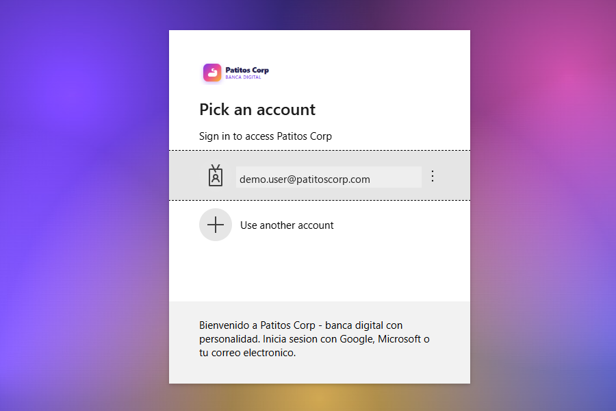

# CIAM Lab — Microsoft Entra External ID end-to-end

[](LICENSE)
[](https://dotnet.microsoft.com/en-us/download/dotnet/8.0)
[](https://learn.microsoft.com/azure/app-service/)

End-to-end lab that deploys a fully-branded **Microsoft Entra External ID (CIAM)** sign-in experience in front of an ASP.NET Core 8 Razor Pages app on **Azure App Service**, with a custom OIDC identity provider, Key Vault for the client secret, EasyAuth, and Microsoft Graph branding (banner, square logos, gradient background).

> The lab ships with a **fictional internet bank ("Patitos Bank")** as default sample copy: customers open their account in minutes through External ID. Everything brand-related is parameterized — see [Customize for your brand](#-customize-for-your-brand).

| Final result |
| --- |
|  |

> 🚀 **Live demo:** [extid-lab-z6px9l.azurewebsites.net](https://extid-lab-z6px9l.azurewebsites.net) — visit the public bank landing, click *Abrir mi cuenta gratis*, open a brand-new account (or bring your own identity), and you'll land on the gated `/Cuenta` banking dashboard.

## Use case & user flow

Reference implementation for **Customer Identity & Access Management (CIAM)** using **Microsoft Entra External ID** as the identity provider for a customer-facing web app. The fictional brand **Patitos Bank** is a 100% digital internet-banking demo: a customer self-opens their account in three minutes by signing up at the public landing page — no branches, no paperwork, no invitations.

**Audience:** identity architects, developers, and PoC builders who need a runnable sample showing:

- External ID tenant + customer-facing user flow (sign-up + sign-in in one).
- App Service hosting with **EasyAuth (custom OIDC)** — no auth code in the app.
- Public marketing pages (bank landing + product catalogue) vs. authenticated banking dashboard.
- Logout via the platform's `/.auth/logout` endpoint.
- Branding parameterized via `appsettings.json` so the same lab can be rebranded for any vertical (bank, fintech, retail, B2C SaaS).

### Self-service account opening & Bring Your Own Identity (BYOI)

The lab is **open to any visitor**: there is no pre-provisioning, no invitation, no admin approval. Anyone hitting *Abrir mi cuenta gratis* who doesn't yet have an account can self-register from the same screen — exactly how a modern internet bank onboards a new customer.

Two ways in:

- **Open a brand-new local account** — email + password (with email OTP verification). The customer record is created on the fly inside the External ID tenant.
- **Bring your own identity (BYOI)** — sign in with an existing identity from a federated identity provider (Google, Microsoft consumer, Facebook, Apple, GitHub, generic OIDC/SAML, or any other IdP configured on the tenant's user flow). No new password is created; External ID federates the existing credential and stores a linked customer profile.

Both paths land on the same authenticated session and the same `/Cuenta` banking dashboard — the app does not care *how* the customer authenticated, only that EasyAuth issued a valid session.

### Flow diagram

```mermaid
flowchart LR
  A[Visitor lands on /] --> B{Authenticated?}
  B -- No --> C[Public bank landing<br/>hero · productos · CTA]
  C --> D["Click 'Abrir mi cuenta gratis'"]
  D --> E[/Account/Login → loginUrl/]
  E --> F[EasyAuth redirects to External ID]
  F --> G[patitoscorp.ciamlogin.com<br/>sign-up or sign-in<br/>Google · Microsoft · email]
  G --> H[OIDC callback /.auth/login/ExternalID/callback]
  H --> I[EasyAuth issues session cookie]
  I --> J[/Cuenta — banking dashboard<br/>saldos · movimientos · claims]
  J --> K["Click 'Cerrar sesión'"]
  K --> L[GET /Account/Logout → /.auth/logout]
  L --> M[Session cleared, redirect to /]
  B -- Yes --> J
```

### Step by step

1. **Anonymous landing (`/`)** — Bank marketing home renders product cards (Cuenta Pato corriente, Tarjeta Pato débito Visa, Patitos Save ahorro, Crédito Pato préstamo personal) and a CTA *Abrir mi cuenta gratis*. No auth required.
2. **Trigger sign-up / sign-in** — Customer clicks *Abrir mi cuenta gratis* or tries to access `/Cuenta`. App routes to `/Account/Login` which builds the EasyAuth login URL with `post_login_redirect_uri=/Cuenta`. The custom OIDC config forwards `prompt` and `domain_hint` query params so the buttons can jump straight to Google / Microsoft or to the create-account screen.
3. **Federated auth at External ID** — EasyAuth redirects the browser to the CIAM tenant (`patitoscorp.ciamlogin.com`) where the customer **signs up or signs in** via the configured user flow (email + password / OTP, or BYOI).
4. **Callback + session** — External ID returns the auth code to `/.auth/login/ExternalID/callback`. EasyAuth exchanges it for tokens and sets the `AppServiceAuthSession` cookie. The app receives identity claims via request headers.
5. **Authenticated banking dashboard (`/Cuenta`)** — Protected page reads claims and renders the customer's banking experience: three account cards (Cuenta Pato Corriente CRC, Cuenta Pato USD, Patitos Save), a transactions table with SINPE transfers, salary deposits, ATM withdrawals, USD purchases, and an educational ID-token claims viewer.
6. **Logout** — Customer clicks *Cerrar sesión* (anchor → `GET /Account/Logout`). The page redirects to `/.auth/logout?post_logout_redirect_uri=/`, clearing the EasyAuth cookie and bouncing back to the public home.

### What the lab demonstrates

- **Zero auth code in the app** — all token handling lives in EasyAuth; the app just reads claim headers.
- **Custom OIDC IdP config** pointed at an External ID tenant (not the built-in Microsoft provider), with `prompt=create` for "open account" and `domain_hint=google.com / live.com` for one-click social sign-up.
- **Mixed public/private routing** in the same app (bank landing public, `/Cuenta` gated).
- **Idempotent logout** via GET (avoids antiforgery 400s).
- **Brand abstraction** — change the `Branding` section in `appsettings.json` to re-skin the lab for any tenant/vertical demo.

---

## 🎨 Customize for your brand

The lab is fully parameterized — you should not have to touch any C# or HTML to re-skin it for your own organization.

### 1. UI text — `src/appsettings.json`

```json
"Branding": {
  "Name":        "Contoso",
  "Suffix":      "Bank",
  "Tagline":     "Banking that works for you.",
  "Description": "Contoso Bank — fictional demo running on Microsoft Entra External ID.",
  "SupportLine": "Built with modern, accessible authentication."
}
```

These values appear in the page title, header, footer, login screen and About page. You can also override them per-environment with App Service application settings using the `Branding__Name` / `Branding__Suffix` / etc. naming convention.

### 2. Logos & background — `branding/`

| File | Used for |
|---|---|
| `branding/banner.png` | Banner logo on the CIAM sign-in page |
| `branding/square.png` | Square logo (light theme) |
| `branding/background.jpg` | Full-page background image |

Replace the bytes, keep the filenames. Re-run `scripts/deploy.sh` (or `deploy.ps1`) with `UPLOAD_BRANDING=true` to push them to your CIAM tenant via Microsoft Graph.

### 3. Deployment parameters — `.env.example`

Copy `.env.example` to `.env` (or export the variables in your shell), edit, then `source .env && ./scripts/deploy.sh`. The most important variables are:

| Variable | What it controls |
|---|---|
| `CIAM_TENANT_ID` | Your External ID (CIAM) tenant id |
| `CIAM_DOMAIN` | e.g. `contoso.ciamlogin.com` |
| `RG_NAME` / `LOCATION` | Where Azure resources land |
| `APP_NAME` | App Service site name (auto-generated if empty) |
| `BRAND_NAME` | Used in the CIAM `signInPageText` |
| `UPLOAD_BRANDING` | Whether deploy script PATCHes `/organization` branding |

### 4. Demo content (optional)

The hero copy on `Pages/Index.cshtml`, the banking dashboard on `Pages/Documentos.cshtml` (served at `/Cuenta`) and the four product cards are sample content. They are flagged with a Razor comment at the top of each page — feel free to delete or rewrite. Brand-specific text inside those samples (e.g. "Cuenta Pato", "Patitos Save") is illustrative filler.

---

## Table of contents

1. [Use case & user flow](#use-case--user-flow)
2. [Architecture](#architecture)
3. [What you'll build](#what-youll-build)
4. [Prerequisites](#prerequisites)
5. [Quick start (one command)](#quick-start-one-command)
6. [Manual step-by-step tutorial](#manual-step-by-step-tutorial)
7. [Repository layout](#repository-layout)
8. [ARM template reference](#arm-template-reference)
9. [Branding via Microsoft Graph](#branding-via-microsoft-graph)
10. [CI/CD with GitHub Actions](#cicd-with-github-actions)
11. [Troubleshooting](#troubleshooting)
12. [Useful documentation](#useful-documentation)

---

## Architecture

```
┌─────────────────┐         ┌──────────────────────────────────────┐
│  Browser        │  HTTPS  │ Azure App Service (Linux, .NET 8)    │
│  (end user)     │ ──────▶ │  ─ EasyAuth (custom OIDC provider)   │
└─────────────────┘         │  ─ ASP.NET Core Razor Pages app      │
        │                   │  ─ Managed Identity → Key Vault      │
        │ OIDC redirect     └─────────────────┬────────────────────┘
        ▼                                     │ secret reference
┌──────────────────────────────────────┐      │
│  Entra External ID (CIAM tenant)     │      ▼
│  contoso.ciamlogin.com           │   ┌──────────────────────┐
│   ─ App registration                 │   │ Azure Key Vault      │
│   ─ Branding (banner / bg / texts)   │   │ ExtIdClientSecret    │
│   ─ User flows / IdPs (Email, Goog…) │   └──────────────────────┘
└──────────────────────────────────────┘
```

Two Microsoft Entra tenants are involved:

| Tenant | Purpose | Example |
| --- | --- | --- |
| **Workforce / subscription tenant** | Hosts your Azure subscription, App Service, Key Vault | `contoso.onmicrosoft.com` |
| **CIAM (External ID) tenant** | Hosts the app registration end users sign in to | `contoso.ciamlogin.com` |

> 📘 **Why two tenants?** External ID separates **customer identities** from your **internal workforce** so customer accounts never appear in your corporate directory.
> See: [Entra External ID overview](https://learn.microsoft.com/entra/external-id/customers/overview-customers-ciam).

---

## What you'll build

* A globally unique App Service (`extid-lab-XXXXXX.azurewebsites.net`) running a small .NET 8 Razor Pages site (`src/`).
* An **App Service Authentication (EasyAuth)** v2 configuration with a **custom OpenID Connect** identity provider pointing at your CIAM tenant.
* An **app registration** in the CIAM tenant with a 24-month client secret stored in **Key Vault** and consumed by App Service via a `@Microsoft.KeyVault(...)` reference.
* **Branded sign-in pages** (logo, square icons, full-screen gradient background, custom sign-in text) uploaded via **Microsoft Graph**.
* Optional **GitHub Actions** workflow for CI/CD using **OIDC federation** (no secrets in GitHub).

---

## Prerequisites

| Tool | Version | Install |
| --- | --- | --- |
| Azure CLI | ≥ 2.60 | <https://learn.microsoft.com/cli/azure/install-azure-cli> |
| .NET SDK | 8.0.x | <https://dotnet.microsoft.com/en-us/download/dotnet/8.0> |
| `jq` (bash flow) | any | `apt install jq` / `brew install jq` |
| `zip` (bash flow) | any | `apt install zip` / `brew install zip` |
| PowerShell 7+ (PS flow) | 7.4+ | <https://learn.microsoft.com/powershell/scripting/install/installing-powershell> |

You also need:

* An **Azure subscription** with **Contributor** rights on the resource group.
* A **CIAM (Entra External ID) tenant** where you can create app registrations.
  Create one in 5 minutes: [Quickstart: Create an external tenant](https://learn.microsoft.com/entra/external-id/customers/quickstart-tenant-setup).

---

## Quick start (one command)

> Clone the repo, then either:

### Bash (Linux / macOS / WSL / Cloud Shell)

```bash
git clone https://github.com/<your-org>/<your-repo>.git
cd <your-repo>

az login

export CIAM_TENANT_ID="<your-ciam-tenant-id>"      # e.g. 938a8e7d-00ed-46bc-8109-161428d9d67c
export CIAM_DOMAIN="<yourtenant>.ciamlogin.com"
export LOCATION="westeurope"

bash scripts/deploy.sh
```

### PowerShell (Windows)

```powershell
git clone https://github.com/<your-org>/<your-repo>.git
cd <your-repo>

az login

./scripts/deploy.ps1 `
    -CiamTenantId "<your-ciam-tenant-id>" `
    -CiamDomain   "<yourtenant>.ciamlogin.com" `
    -Location     "westeurope"
```

The script prints a final summary like:

```
============================================================
 DEPLOY OK
 App URL          : https://extid-lab-XXXXXX.azurewebsites.net
 Redirect URI     : https://extid-lab-XXXXXX.azurewebsites.net/.auth/login/ExternalID/callback
 Resource group   : rg-ciam-lab
 App Service      : extid-lab-XXXXXX (B1)
 Key Vault        : kv-extidlab-xxxx
 CIAM tenant      : 938a8e7d-00ed-46bc-8109-161428d9d67c
 CIAM domain      : contoso.ciamlogin.com
 App reg (client) : <guid>
============================================================
```

Open the App URL → click **Ingresar** → you land on a fully branded `*.ciamlogin.com` page.

---

## Manual step-by-step tutorial

If you prefer to execute the pieces manually (great for learning), follow these steps. Every command has a `📘` link to the official docs.

### 1. Create the resource group

```bash
az group create -n rg-ciam-lab -l westeurope
```

📘 [`az group create`](https://learn.microsoft.com/cli/azure/group#az-group-create)

### 2. Create the app registration in the CIAM tenant

```bash
az login --tenant <ciam-tenant-id> --allow-no-subscriptions
APP_ID=$(az ad app create --display-name "CIAM Lab Web" --sign-in-audience AzureADMyOrg --query appId -o tsv)
APP_OBJ=$(az ad app show --id "$APP_ID" --query id -o tsv)

# Generate a client secret (24-month)
SECRET=$(az ad app credential reset --id "$APP_ID" --display-name deploy-script --years 2 --query password -o tsv)
echo "Client id    : $APP_ID"
echo "Client secret: $SECRET   # store immediately, this is the only time you'll see it"
```

📘 [`az ad app create`](https://learn.microsoft.com/cli/azure/ad/app#az-ad-app-create) · [App registration concepts](https://learn.microsoft.com/entra/identity-platform/quickstart-register-app)

### 3. Deploy the ARM template

```bash
az login   # back to your subscription tenant

az deployment group create \
  --resource-group rg-ciam-lab \
  --template-file infra/azuredeploy.json \
  --parameters \
      appName="extid-lab-mydemo" \
      location="westeurope" \
      ciamTenantId="<ciam-tenant-id>" \
      ciamClientId="$APP_ID" \
      ciamDomain="contoso.ciamlogin.com"
```

What this provisions:

* `Microsoft.Web/serverfarms` — Linux App Service Plan (B1)
* `Microsoft.Web/sites` — App Service with system-assigned **Managed Identity**
* `Microsoft.Web/sites/config/authsettingsV2` — EasyAuth v2 with **custom OIDC provider** pointing at your CIAM `.well-known/openid-configuration`
* `Microsoft.KeyVault/vaults` — RBAC-enabled Key Vault
* `Microsoft.Authorization/roleAssignments` — App Service identity gets **Key Vault Secrets User**

📘 [Deployment template reference](https://learn.microsoft.com/azure/azure-resource-manager/templates/) · [App Service authsettingsV2](https://learn.microsoft.com/azure/app-service/configure-authentication-customize-sign-in-out)

### 4. Store the client secret in Key Vault

```bash
KV_NAME=$(az deployment group show -g rg-ciam-lab -n azuredeploy --query properties.outputs.keyVaultName.value -o tsv)
ME=$(az ad signed-in-user show --query id -o tsv)
az role assignment create --assignee-object-id "$ME" --assignee-principal-type User \
  --role "Key Vault Secrets Officer" \
  --scope "$(az keyvault show -n $KV_NAME -g rg-ciam-lab --query id -o tsv)"
sleep 20  # wait for RBAC propagation
az keyvault secret set --vault-name "$KV_NAME" --name ExtIdClientSecret --value "$SECRET"
```

📘 [Reference Key Vault secrets from App Service](https://learn.microsoft.com/azure/app-service/app-service-key-vault-references)

### 5. Register the redirect URI on the app registration

```bash
APP_HOST=$(az deployment group show -g rg-ciam-lab -n azuredeploy --query properties.outputs.appHostname.value -o tsv)
REDIRECT="https://$APP_HOST/.auth/login/ExternalID/callback"

az login --tenant <ciam-tenant-id> --allow-no-subscriptions
az ad app update --id "$APP_ID" --web-redirect-uris "$REDIRECT"
```

📘 [Redirect URI reference](https://learn.microsoft.com/entra/identity-platform/reply-url)

### 6. Build & deploy the app

```bash
dotnet publish src/CiamLabApp.csproj -c Release -o ./publish
( cd publish && zip -r ../app.zip . )
az login   # back to subscription tenant
az webapp deploy -g rg-ciam-lab -n extid-lab-mydemo --src-path app.zip --type zip
```

📘 [`az webapp deploy`](https://learn.microsoft.com/cli/azure/webapp#az-webapp-deploy) · [Deploy ZIP package](https://learn.microsoft.com/azure/app-service/deploy-zip)

### 7. Brand the CIAM sign-in (Microsoft Graph)

```bash
az login --tenant <ciam-tenant-id> --allow-no-subscriptions
TOKEN=$(az account get-access-token --resource https://graph.microsoft.com --query accessToken -o tsv)
ORG=<ciam-tenant-id>

# Default localization (id=0) holds the language-neutral assets
curl -X POST "https://graph.microsoft.com/v1.0/organization/$ORG/branding/localizations" \
  -H "Authorization: Bearer $TOKEN" -H "Content-Type: application/json" \
  -d '{"id":"0","signInPageText":"Bienvenido a CIAM Lab","backgroundColor":"#1A1B3A"}'

# Banner (≤ 280×60, PNG)
curl -X PUT "https://graph.microsoft.com/v1.0/organization/$ORG/branding/localizations/0/bannerLogo" \
  -H "Authorization: Bearer $TOKEN" -H "Content-Type: image/png" -H "Accept-Language: 0" \
  --data-binary @branding/banner.png

# Square logos (light + dark, ≤ 240×240, PNG)
curl -X PUT ".../localizations/0/squareLogo"     -H "Content-Type: image/png" --data-binary @branding/square.png
curl -X PUT ".../localizations/0/squareLogoDark" -H "Content-Type: image/png" --data-binary @branding/square.png

# Background (JPEG, ≤ 1920×1080)
curl -X PUT ".../localizations/0/backgroundImage" -H "Content-Type: image/jpeg" --data-binary @branding/background.jpg
```

📘 [`organizationalBranding` API](https://learn.microsoft.com/graph/api/resources/organizationalbranding) · [Branding properties + size limits](https://learn.microsoft.com/graph/api/resources/organizationalbrandinglocalization)

> **Tip on the background image:** if your generator clips the image (e.g. you produce it via headless Chromium), keep the source image small (e.g. 900×500). Microsoft's CIAM front-end stretches the asset using CSS `background-size: cover`, so a smaller blurred gradient looks crisp full-screen.

### 8. Try it

```bash
xdg-open "https://$APP_HOST"   # or just open the URL in any browser
```

Click **Ingresar** → you should be redirected to `https://<yourtenant>.ciamlogin.com` showing **your branded sign-in page**.

---

## Repository layout

```
ciam-lab/
├── .github/workflows/deploy.yml         GitHub Actions CI/CD (OIDC -> Azure)
├── branding/
│   ├── banner.png                       280x60 banner logo
│   ├── square.png                       240x240 square logo (light + dark)
│   └── background.jpg                   gradient mesh background
├── docs/images/
│   └── verify-ciam.png                  final result screenshot
├── infra/
│   ├── azuredeploy.json                 ARM template (App Service + Plan + KV + RBAC + EasyAuth)
│   └── azuredeploy.parameters.example.json
├── scripts/
│   ├── deploy.sh                        end-to-end bash deployment
│   └── deploy.ps1                       end-to-end PowerShell deployment
├── src/                                 ASP.NET Core 8 Razor Pages app
│   ├── CiamLabApp.csproj
│   ├── Program.cs                       cookie auth + EasyAuth bridge
│   ├── Pages/
│   ├── wwwroot/
│   └── appsettings.json
├── .gitignore
├── LICENSE                              MIT
└── README.md                            (this file)
```

---

## ARM template reference

[`infra/azuredeploy.json`](infra/azuredeploy.json) — parameters:

| Parameter | Default | Notes |
| --- | --- | --- |
| `appName` | `extid-lab-<uniqueString>` | Globally unique App Service name |
| `location` | resource group region | Any region with App Service |
| `skuName` | `B1` | `F1` works but disables EasyAuth Always On |
| `dotnetVersion` | `DOTNETCORE\|8.0` | Linux runtime stack |
| `keyVaultName` | `kv-extidlab-<uniqueString>` | 3–24 chars |
| `tenantId` | subscription tenant | Used for KV RBAC |
| `ciamTenantId` | _required_ | CIAM tenant id |
| `ciamClientId` | _required_ | App registration `appId` |
| `ciamDomain` | _required_ | `<tenant>.ciamlogin.com` |

Outputs: `appName`, `appHostname`, `appUrl`, `redirectUri`, `keyVaultName`, `principalId`.

📘 [ARM template best practices](https://learn.microsoft.com/azure/azure-resource-manager/templates/best-practices)

---

## Branding via Microsoft Graph

| Asset | Endpoint | Format | Max size |
| --- | --- | --- | --- |
| Banner logo | `bannerLogo` | PNG | 280 × 60 |
| Square logo (light) | `squareLogo` | PNG | 240 × 240 |
| Square logo (dark) | `squareLogoDark` | PNG | 240 × 240 |
| Background image | `backgroundImage` | JPEG | 1920 × 1080, ≤ 300 KB |
| Favicon | `favicon` | ICO | 32 × 32 |
| Texts / colors | PATCH `localizations/0` | JSON | — |

All endpoints follow:

```
PUT https://graph.microsoft.com/v1.0/organization/{tenantId}/branding/localizations/{lcid}/{asset}
Headers: Authorization: Bearer <token>; Content-Type: <mime>; Accept-Language: <lcid>
Body: <raw bytes>
```

`{lcid}` = `0` for the default (language-neutral) experience. To localize for `es-MX`, create another localization with `id="es-MX"` and PUT each asset there too.

📘 [Customize the sign-in experience](https://learn.microsoft.com/entra/external-id/customers/how-to-customize-branding-customers)

---

## CI/CD with GitHub Actions

[`.github/workflows/deploy.yml`](.github/workflows/deploy.yml) builds + zip-deploys on every push to `main`. It uses **OIDC federation** (no long-lived secrets):

1. Create an Entra app registration for GitHub Actions in your subscription tenant.
2. Add a **federated credential** with subject `repo:<your-org>/<your-repo>:ref:refs/heads/main`.
3. Grant it `Contributor` on the resource group.
4. Add three GitHub repo secrets:
   * `AZURE_CLIENT_ID`
   * `AZURE_TENANT_ID`
   * `AZURE_SUBSCRIPTION_ID`
   * `AZURE_WEBAPP_NAME`

📘 [Federated identity for GitHub Actions](https://learn.microsoft.com/azure/developer/github/connect-from-azure)

---

## Troubleshooting

<details>
<summary><strong>"AADSTS50011: redirect URI mismatch"</strong></summary>

The redirect URI registered in the app registration must exactly match `https://<app>.azurewebsites.net/.auth/login/ExternalID/callback`. Re-run step 5 of the manual tutorial.

</details>

<details>
<summary><strong>App Service shows the default ASP.NET Core welcome page</strong></summary>

The zip didn't deploy correctly. Check `az webapp log tail -g rg-ciam-lab -n <app>`. Most common cause is publishing **the project folder** instead of the **publish output**. Re-run the build with `dotnet publish -c Release -o ./publish` and zip the contents of `publish/`.

</details>

<details>
<summary><strong>Key Vault reference shows up as a literal string</strong></summary>

App Service caches Key Vault references for ~24h. After granting the role, restart the app: `az webapp restart -g rg-ciam-lab -n <app>`. Verify with `az webapp config appsettings list ... --query "[?name=='ExtId__ClientSecret']"` — the value should appear as `@Microsoft.KeyVault(...)` and the portal Configuration blade should show a green **Resolved** badge.

</details>

<details>
<summary><strong>Background image looks tiny / clipped</strong></summary>

If you generated the JPEG via headless Chromium, the screenshot may have been clipped to the browser viewport (often capped at ~934 × 631 in sandboxed environments) regardless of the requested viewport size. Workaround: generate at a smaller logical size (e.g. 900 × 500) and let CIAM's `background-size: cover` upscale it. The branding endpoint accepts < 1920 × 1080.

</details>

---

## Useful documentation

* [Microsoft Entra External ID for customers (CIAM)](https://learn.microsoft.com/entra/external-id/customers/overview-customers-ciam)
* [App Service authentication overview](https://learn.microsoft.com/azure/app-service/overview-authentication-authorization)
* [Configure custom OIDC provider for App Service](https://learn.microsoft.com/azure/app-service/configure-authentication-provider-openid-connect)
* [Use Key Vault references in App Service](https://learn.microsoft.com/azure/app-service/app-service-key-vault-references)
* [Manage organizational branding (Graph)](https://learn.microsoft.com/graph/api/resources/organizationalbranding)
* [ARM template tutorials](https://learn.microsoft.com/azure/azure-resource-manager/templates/template-tutorial-create-first-template)
* [`az webapp deploy`](https://learn.microsoft.com/cli/azure/webapp#az-webapp-deploy)
* [Federated credentials with GitHub Actions](https://learn.microsoft.com/azure/developer/github/connect-from-azure)

---

## License

[MIT](LICENSE) — fork it, learn from it, ship your own.
